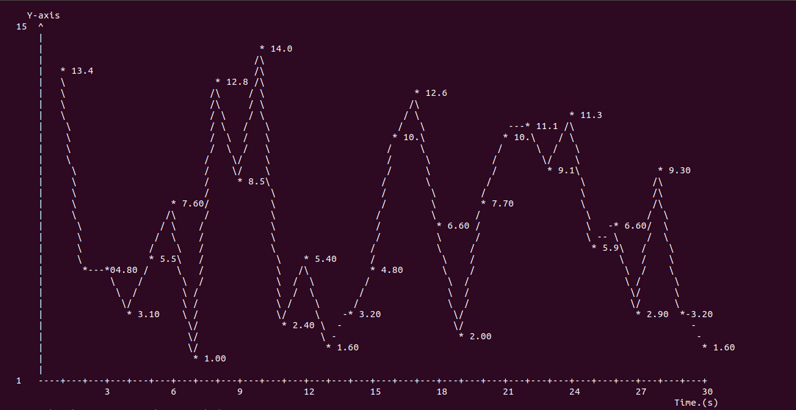

# roshell
roshell - An interactive shell for robotics applications

You can do this in `roshell`!




# Quickstart:
There are two options to build and run `roshell`.
### Option 1: Without ROS
If you do not have ROS installed, you cannot use the Robotic features that `roshell` offers.
```shell
git clone https://github.com/deepaktalwardt/roshell.git
cd roshell
make
```

## Option 2: If you have ROS installed...
This will only work on Ubuntu 18.04 with ROS Melodic Morenia installed. If you wish you install ROS, please follow instructions here: http://wiki.ros.org/melodic/Installation
```shell
git clone https://github.com/deepaktalwardt/roshell.git
cd roshell
source build.sh
```
Sourcing ```build.sh``` script file builds both ROS file (catkin_make) and roshell (make), launches separate terminals for roscore and rosbag, and starts ```roshell``` executable.  From ```roshell``` command, you can run roslaunch to see the visualizer.

You should see a bunch of environment variables, and then a prompt in white/blue/yellow colors:

```shell
[roshell] deepak@deepak-pc:/home/deepak$ 
```
Currently, `roshell` supports many of the commands and features that bash supports. Some examples:

```
[roshell] deepak@deepak-pc:/home/deepak/roshell$ whoami
deepak
[roshell] deepak@deepak-pc:/home/deepak/roshell$ cd ros_ws
[roshell] deepak@deepak-pc:/home/deepak/roshell/ros_ws$
```

# Documentation

This is a list of features that we implemented along with a brief description on how to test them.

<hr>

## Source Command

```source``` command reads a text file with multiple lines of commands.
To test the command, source "test.sh" script file.
```
[roshell] deepak@deepak-pc:/home/deepak/roshell$ source test.sh
```
## Auto Complete

Pressing ```tab``` button auto-completes the input file name only when one match occurs.
When multiple matches occur, pressing ```tab``` second time, all matching files are listed.
For the first word in command line, it searches the matching files from ```$PATH```.
For the other words in command line, it searches files the current directory only.

## Interupting a program with Ctrl+C
The user can interrupt program execution with Ctrl+C
```
[roshell] deepak@deepak-pc:/home/deepak/roshell$ sleep 10000
```

```sleep``` will be sent a SIGINT, and will exit. However, ```roshell``` does **not** exit.

## Variable Handling

A variable can be assigned using '=' and retrieved with '$'
```
[roshell] deepak@deepak-pc:/home/deepak/roshell$ var=1
[roshell] deepak@deepak-pc:/home/deepak/roshell$ echo $var
1
```
## History command
```
[roshell] deepak@deepak-pc:/home/deepak/roshell$ history
History List:
whoami
var=1
echo $var
[roshell] deepak@deepak-pc:/home/deepak/roshell$ history clear
History Cleared
```

You can also use the up and down arrows to scroll through previously entered commands.

# Robotic Features
Before running these features, ensure that you have built `roshell` with ROS.

Then, you can run the ROS nodes provided inside the packages in the `ros_ws/src` directory.

## Point Cloud Visualization
### From PCD file
To visualize a point cloud stored in the PCD file, you need to run the `pcd_visualizer_node`. First, download a test PCD file provided [here](https://drive.google.com/open?id=1HfrEJ8wTFe-DFC0YWpUx6X5AZ5MJgBFG) and place it in `ros_ws/src/roshell_graphics/test/` directory. Then, use rosrun
```
rosrun roshell_graphics pcd_visualizer_node
```
If you downloaded the PCD file somewhere else, you can change the path in `ros_ws/src/roshell_graphics/src/pcd_visualizer_node.cpp` and recompile and run.

### From ROS bags
To visualize point clouds streaming from a rosbag inside the terminal, you will need to launch the ROS Node `pcl2_visualizer_node` and play the rosbag provided [here](https://drive.google.com/open?id=1z4M2eawrsd_YgwQ4UPVxoBvqgmICQmMB). Download it to a location and navigate there.

First, make sure that `roscore` is running, then play the rosbag
```
rosbag play test_bag_filtered.bag
```

In a different terminal, start the visualizer

```
roslaunch roshell_graphics pcl2_visualizer.launch colormap:=false
```
This should now start visualizing the point clouds that are streamed from the rosbag over the default topic : `/simulator/lidar`. The window should look something like this:


This node allows for some parameters to be changed as needed. See the `ros_ws/src/roshell_graphics/launch/pcl2_visualizer.launch` file for more details. For example, to change the camera focal distance (which controls the zoom level) and input topic, you should launch the node like this
```
roslaunch roshell_graphics pcl2_visualizer cam_focal_distance:=500 in_topic:=/lidar
```
With colormap turned on, the visualization looks something like this:


## Line Plots

To create line plots, we first need to have a publisher node that will publish random values to be plot on the line plot. To do that, launch the following
```
roslaunch roshell_graphics float_visualizer.launch
```
This will start both a floating point publisher and a subscriber and start printing values to the scren.

## Visualizing images

To test image functionality, make sure that the ROS bag you downloaded earlier is playing, then you can run the node.
```bash
rosrun roshell_graphics image_viewer_node
```
If the images are being published on a different topic, or if you're using a different ROS bag, you can supply the topic to listen to using
```bash
rosrun roshell_graphics image_viewer_node _in_topic:=/wide_stereo/right/image_raw
```

