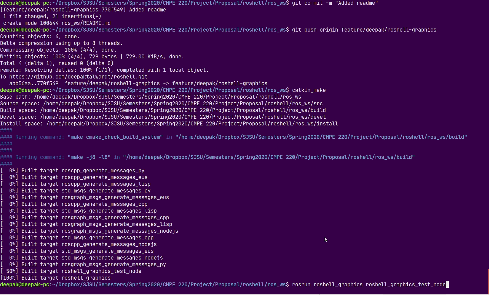
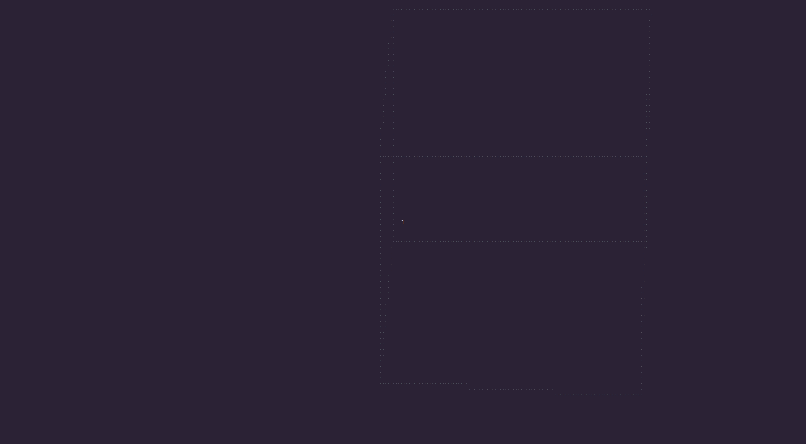

# roshell's ROS Workspace
Before you begin, make sure that ROS is installed. This code is tested with ROS Melodic. To build the packages, run
```
cd ros_ws
catkin_make
```
After the workspace is built, source `devel/setup.bash` with
```
source devel/setup.bash
```

# Packages
## `roshell_graphics`
`roshell_graphics` package provides drawing functions for the terminal. This package is responsible for subscribing to ROS topics and visualizing them on the terminal window. Currently it supports the following visualizations:

### Line Drawing
To test line drawing, see `roshell_graphics_test_node.cpp`
```
rosrun roshell_graphics roshell_graphics_test_node
```
This will randomly draw 10 lines on the terminal one after another like this.



### Perspective Projection
To see perspective projection of a cube onto the terminal, see `roshell_graphics_test_node.cpp`, and run it using the command above.

This will produce a rotating cube like the one below
